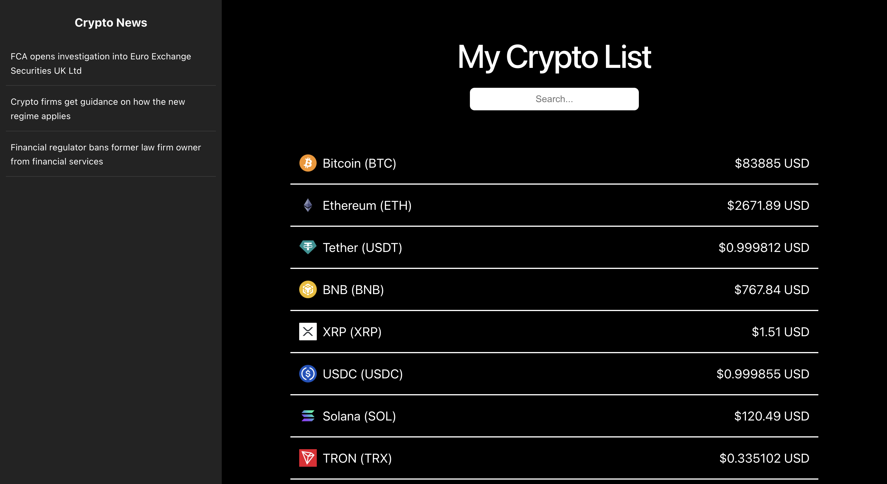
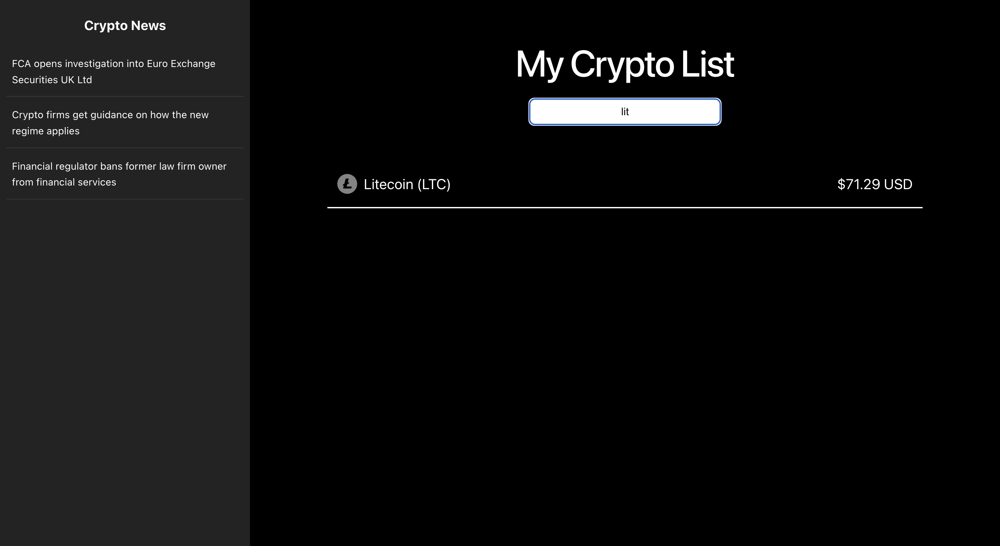

# 💸 Crypto Hustle

A live cryptocurrency dashboard built with React and Vite. It pulls the top coins by market cap from the CoinGecko API, shows each coin's icon, name, symbol, and USD price, and lets you filter the list as you type. A fixed sidebar streams in recent crypto news headlines from a free news API.

Built for CodePath WEB 102, Unit 4 Lab.

## Features

### Required
- Fetches the top coins by market cap from the CoinGecko API in a `useEffect()` that runs once on load
- Displays each coin as its own `CoinInfo` component showing icon, name, symbol, and current USD price
- A search bar that filters the list on the fly by coin name or symbol, with conditional rendering from the filtered results

### Stretch
- A fixed side navigation bar (`SideNav`) for extra crypto information
- A `CryptoNews` component that queries a free crypto news API and renders recent article headlines as links

## Walkthrough

### The dashboard
The full page: the "My Crypto List" title, a centered search bar, coins listed as `Name (SYMBOL)` with right-aligned USD prices, and the Crypto News sidebar on the left.



### Searching / filtering
Typing into the search bar filters the list in real time by coin name or symbol; clearing the box restores the full list.



### Stretch: news sidebar
The fixed sidebar lists recent crypto news headlines, each linking out to the source article.


### Demo
A full run: the coin list loading, filtering with the search bar, and the news sidebar.

https://github.com/user-attachments/assets/3466af04-7947-4485-ac5b-c4338cde932b

## What I practiced
- Making API calls inside a `useEffect()` with `async`/`await` and `fetch`
- Saving fetched JSON to state with `useState` to trigger a re-render
- Passing data into custom components via props (`CoinInfo`)
- Rendering lists with `.map()` and optional chaining (`list?.map`)
- Conditional rendering to switch between the full list and filtered results
- Splitting the UI into reusable components (`CoinInfo`, `SideNav`, `CryptoNews`)
- Using environment variables for an API key with Vite (`import.meta.env`)

## Running locally

```bash
npm install
npm run dev
```

Then open the `http://localhost:5173/` link that Vite prints.

### Environment variables
This project reads a CoinGecko demo API key from a `.env` file at the project root:

```
VITE_APP_API_KEY="your-coingecko-demo-api-key"
```

## Tech stack
- React 19
- Vite

## APIs used
- [CoinGecko API](https://docs.coingecko.com/) — top coins by market cap, prices, and icons
- [Free Crypto News](https://cryptocurrency.cv/) — recent crypto news headlines (keyless)
